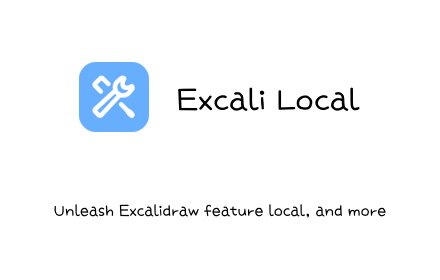
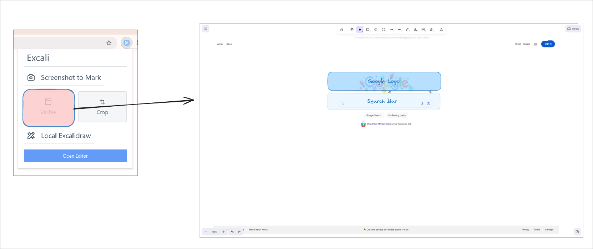
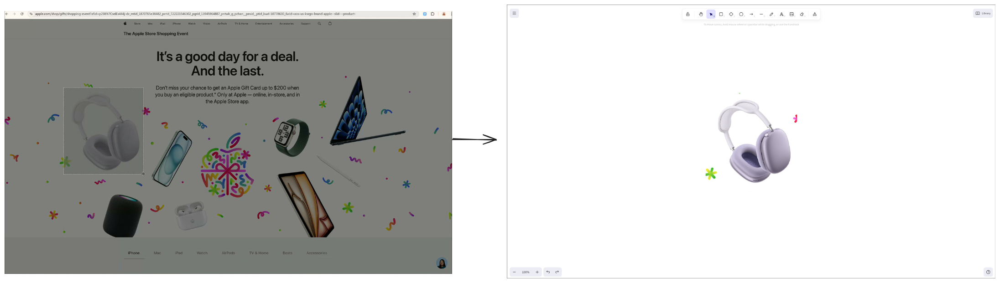
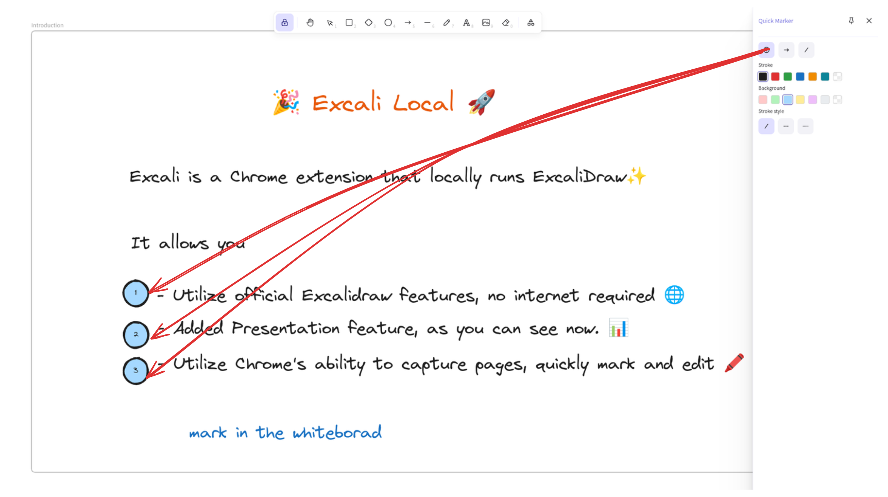
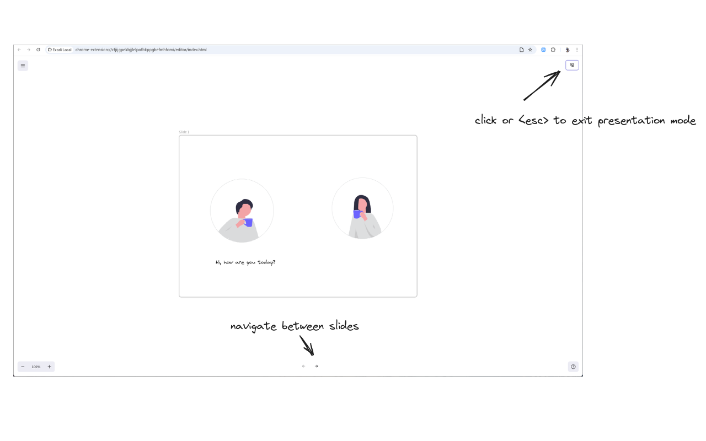
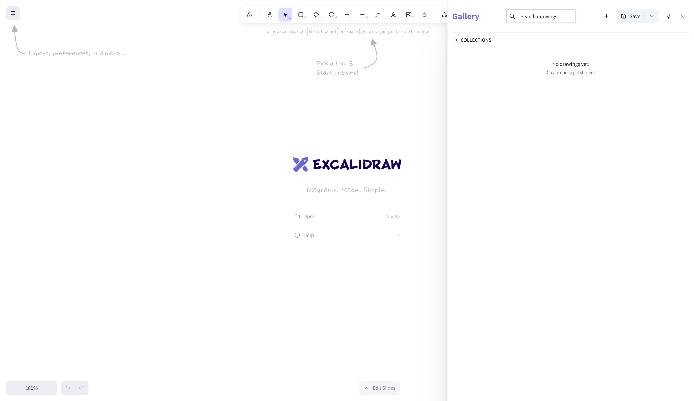
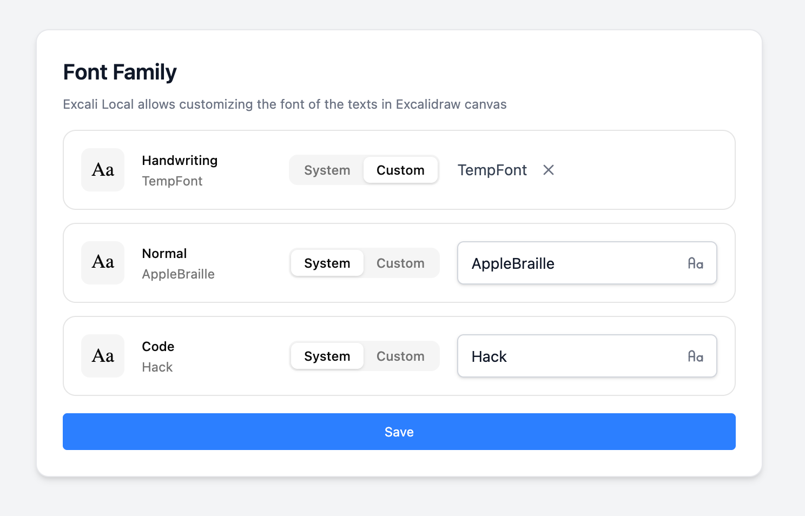

# 🎨 Excali Local

> A powerful browser extension that brings offline Excalidraw editing with screenshot annotation and presentation features.

<p align="center">
  
</p>

## ✨ Key Features

- **📸 Smart Screenshot Annotation** - Capture any webpage area and instantly annotate with Excalidraw
- **🔧 Offline Excalidraw Editor** - Full-featured local editor that works without internet
- **🗂️ Gallery & Collection Management** - Save, organize, and manage multiple drawings locally with collections
- **📦 Export Gallery** - Export all drawings as a ZIP archive for backup or migration to excalidraw.com
- **📊 Presentation Mode** - Turn your drawings into interactive slide presentations
- **⌨️ Keyboard Shortcuts** - Quick access to all features
- **🌙 Dark Mode Support** - Seamless theme switching
- **🅰️ Custom Font Support** - Upload and use your own .ttf, .woff, or .woff2 files

## 🚀 Quick Start

### Install
- [Chrome Web Store](https://chromewebstore.google.com/detail/excali-local/ebmgbhnihcbgpbcjnjeamnkkplnppddd)
- [Firefox Add-ons](https://addons.mozilla.org/addon/excali-local)
- [Edge Add-ons](https://microsoftedge.microsoft.com/addons/detail/excali-local/kflccadkimelkkjcmedhhfbnnlbdggol)

### Demo
- [YouTube](https://youtu.be/_aHWUz9Og-I) | [Bilibili](https://www.bilibili.com/video/BV1gJqnY3EAP)

## 📖 How It Works

### 1. Screenshot & Annotate
 

Capture full page or select specific areas, then annotate directly in Excalidraw.

### 2. Smart Marking Tools


Use specialized marking tools for quick annotations and callouts.

### 3. Presentation Mode


Transform your drawings into professional presentations with slide navigation.

### 4. Gallery & Collection Management


Save and organize your drawings with powerful gallery features:
- **Save & Load** - Store multiple drawings locally with auto-generated thumbnails
- **Collections** - Group related drawings into collections for better organization
- **Search** - Quickly find drawings with real-time search functionality
- **Drawing Management** - Rename, overwrite, or delete drawings with ease
- **Export Gallery** - Export all drawings as a ZIP archive for backup or migration to excalidraw.com


All your work is stored locally in IndexedDB, ensuring privacy and offline access.

### 5. Custom Font Support


Personalize your drawings by using your own typography:
- **Uploading Cutomized Font or Using System Font Family** - Support for `.ttf`, `.woff`, and `.woff2` font files
- **Automatic Injection** - Seamlessly integrated into the Excalidraw editor via FontFace API

## 🛠️ Development

This project uses a monorepo structure with Bun as the package manager.

```bash
# Install dependencies
bun install

# Development
bun run page:dev      # Start editor webapp
bun run local:dev     # Start extension development

# Build
bun run page:build    # Build editor webapp
bun run local:build   # Build extension
bun run local:tar     # Archive build assets
```

## 🗺️ Roadmap

- [x] Screenshot annotation with area selection
- [x] Offline Excalidraw editor
- [x] Presentation mode with slide navigation
- [x] Keyboard shortcuts support
- [x] Internationalization (i18n)
- [x] Dark mode support
- [x] Settings customization
- [x] Gallery & Collection Management in local
- [x] Gallery export to ZIP
- [x] Custom binary font support (.ttf, .woff, .woff2)

---

*Screenshots from [unDraw](https://undraw.co/) - Free illustrations for everyone.*

