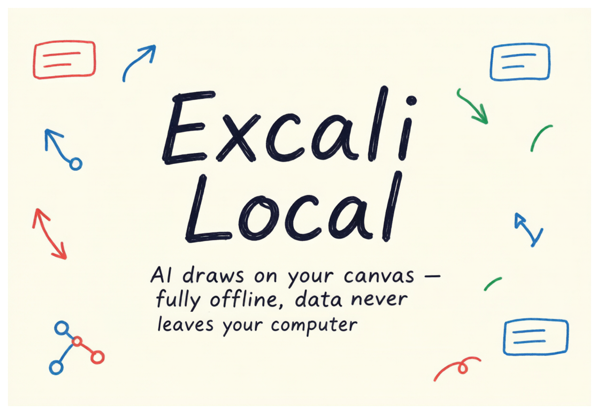
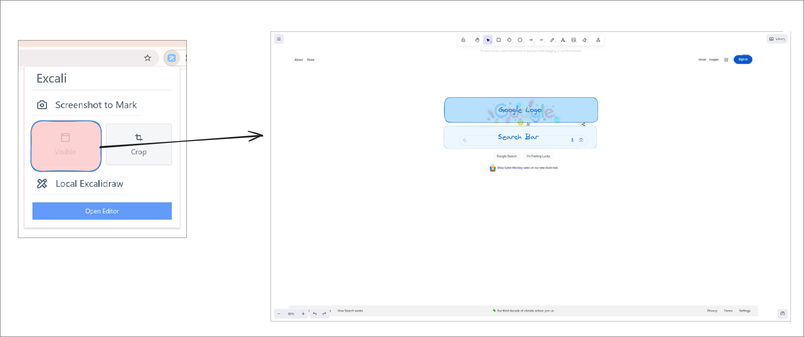
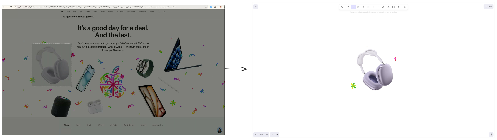
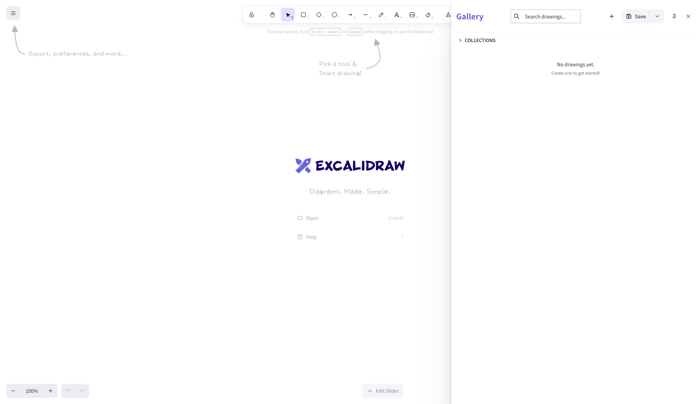
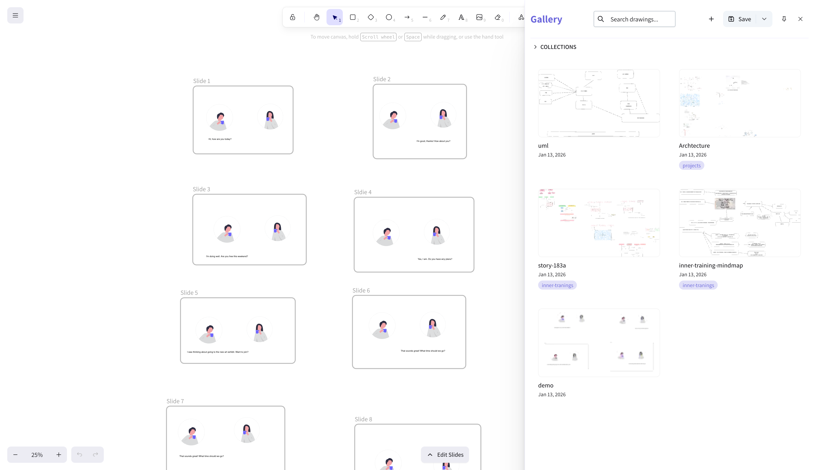
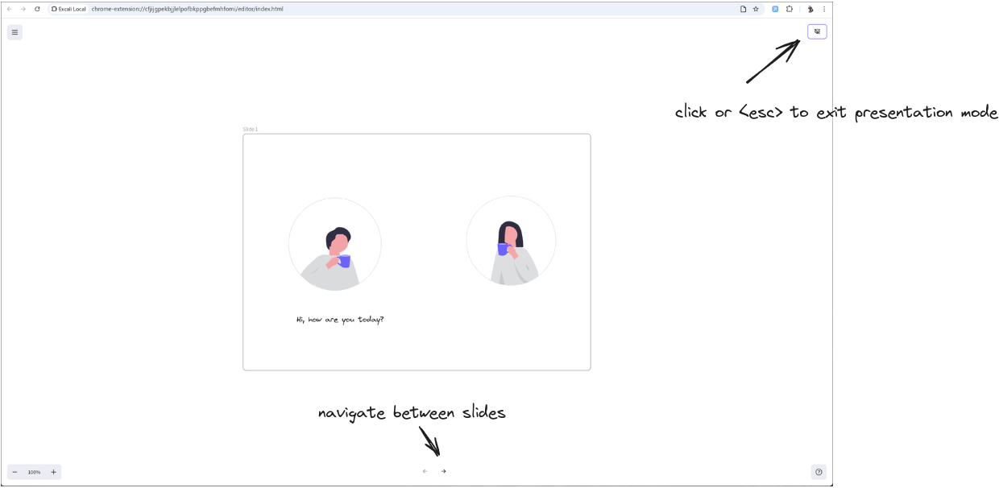
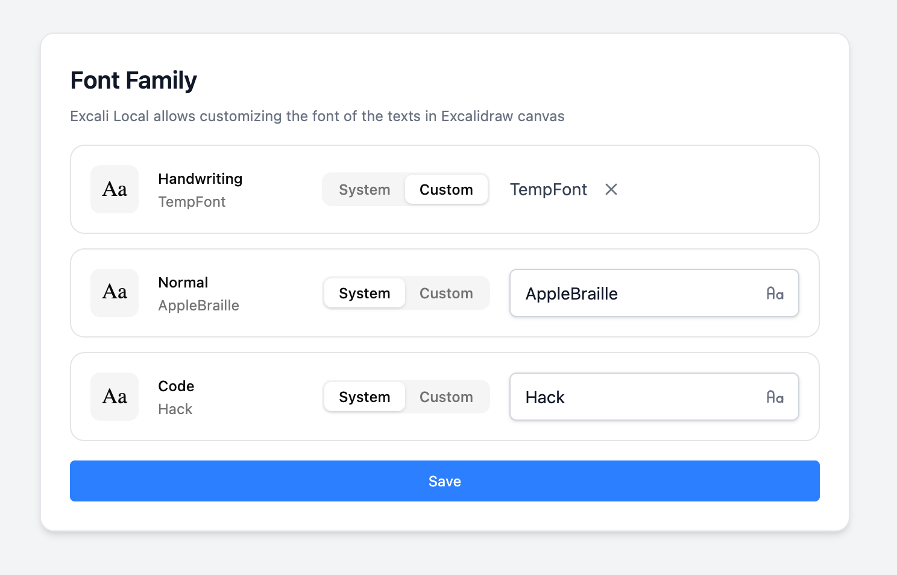

# Excali Local

[简体中文](./README.zh-CN.md)

> A local-first, offline Excalidraw app that lives entirely in your browser.

<p align="center">
  
</p>

Excali Local is a browser extension that brings **Excalidraw fully offline**: screenshot annotation, a complete local editor, a private gallery, and presentation mode — with no backend, no account, no uploads. Every drawing stays in your browser.

## New in v1.8.0

- **Realtime collaboration** — hostless, end-to-end-encrypted rooms over a relay you deploy yourself (a ~150-line PartyKit reference; no Excali Local backend — the relay forwards ciphertext only). Team rooms are E2E to your org, private rooms E2E per room; file sync included. → [Collaboration Guide](docs/COLLAB.md) · [ADR 0003](docs/adr/0003-byo-relay-realtime-collab.md)

## New in v1.7.0

- **Import your gallery from a ZIP** — bring a previously exported archive (even one edited outside the app) back into your gallery.
- **Agent-driven editing** — drive the active canvas from a CLI or an AI agent through the `excali-local` Skill and the `excali-bridge` daemon, over a local-only WebSocket. → [Agent Bridge Guide](docs/AGENT_BRIDGE.md)

> Quick start (~1 min, silent, bilingual subtitles):
>
> [](https://youtu.be/0ceYcxnoB9M)


## Features

- **Screenshot annotation** — capture a full page or select an area, then annotate it in Excalidraw.
- **Offline editor** — the complete Excalidraw experience, no internet connection required.
- **Gallery & collections** — save, organize, search, and manage drawings locally; export or import everything as a ZIP archive.
- **Presentation mode** — turn any drawing into a slide-based presentation.
- **Custom fonts** — upload `.ttf`, `.woff`, or `.woff2` fonts, or use your system fonts, on an editor built from a fully-offline fork of Excalidraw 0.18.
- **Direct `.excalidraw` file opening** — open files from any website or local folder in the editor.
- **Keyboard shortcuts & dark mode** — fast access everywhere, easy on the eyes at night.

## Install

- [Chrome Web Store](https://chromewebstore.google.com/detail/excali-local/ebmgbhnihcbgpbcjnjeamnkkplnppddd)
- [Firefox Add-ons](https://addons.mozilla.org/addon/excali-local)
- [Edge Add-ons](https://microsoftedge.microsoft.com/addons/detail/excali-local/kflccadkimelkkjcmedhhfbnnlbdggol)

Demo: [YouTube](https://youtu.be/_aHWUz9Og-I) | [Bilibili](https://www.bilibili.com/video/BV1gJqnY3EAP)

## How it works

1. **Screenshot & annotate** — capture a full page or select an area, then annotate directly in Excalidraw.

| Capture a full page | Select an area |
|:-:|:-:|
|  |  |

2. **Edit & organize locally** — every drawing lives in your browser (IndexedDB). Group drawings into collections, search them, and export or import everything as a ZIP archive.

| Empty gallery sidebar | Gallery with a drawing |
|:-:|:-:|
|  |  |

3. **Present** — turn drawings into slide presentations with simple navigation.



4. **Personalize** — upload your own fonts or use system font families (`.ttf`, `.woff`, `.woff2`).



5. **Open `.excalidraw` files** — recognized files get an “Open with Excali Local” button that imports them instantly.

<video src="https://github.com/user-attachments/assets/3be7b273-cac4-4fc8-ab03-5bb50eab8cd4" autoplay loop muted></video>

6. **Drive the canvas from an agent or CLI** — enable agent access in the extension, install the Skill (`npx skills add azzgo/excali-local --skill excali-local -y`), and draw programmatically over the local WebSocket bridge. Full guide: [Agent Bridge Guide](docs/AGENT_BRIDGE.md).

## See also

Reference implementations consulted when building the agent-drive feature:

- [smart-excalidraw-next](https://github.com/liujuntao123/smart-excalidraw-next) — a Next.js Excalidraw app with agent-driven canvas control.
- [excalidraw-diagram-skill](https://github.com/coleam00/excalidraw-diagram-skill) — an agent skill for drawing Excalidraw diagrams.

## Development

Monorepo built with pnpm.

```bash
pnpm install        # install dependencies
pnpm page:dev       # start the editor webapp
pnpm page:build     # build the editor webapp
pnpm local:build    # build the extension (then load .output/chrome-mv3 unpacked)
pnpm local:tar      # archive build assets
```

---

*Screenshots from [unDraw](https://undraw.co/) — free illustrations for everyone.*

