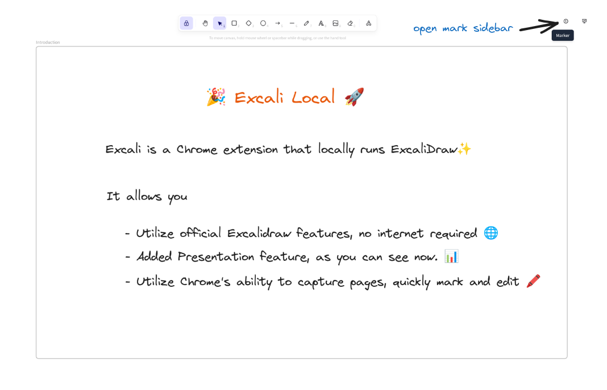

# 🎉 Excali Local 🚀

<p align="center">
  
</p>

## Introduction

Excali Local is a local extension for [Excalidraw](https://excalidraw.com/), it provides a offline editor for Excalidraw and add presentation mode for Excalidraw.

- Chrome: [Chrome Web Store](https://chromewebstore.google.com/detail/excali-local/ebmgbhnihcbgpbcjnjeamnkkplnppddd)
- FireFox: [Firefox Add-ons](https://addons.mozilla.org/addon/excali-local)

Demo video: 
- [Youtube](https://youtu.be/_aHWUz9Og-I)
- [BliBli](https://www.bilibili.com/video/BV1gJqnY3EAP)

## Features


### Page Screenshot for Quicking mark

#### Capture Visible Tab


#### Select Area


### Mark in Whiteboard




### Presentation mode


Note: the demo upside screenshot marterial is from [unDraw](https://undraw.co/), it is very nice and free to use.

## Development

To install dependencies:

```bash
bun install
```


Project organizated with mono-repo pattern.

To run the webapp of editor to start developing:

```bash
bun run page:dev
```

use the following command to build the webapp, it will bundle the webapp and put it in the `local` package's `public/editor` folder.

```bash
bun run page:build
```

To developing the local extension, run command:

```bash
bun run local:dev
```

To build the local extension, run command:

```bash
bun run local:build
```

To run the command to archive the local extension build assets, run command:

```bash
bun run local:tar
```

## Roadmap

- [x] Add presentation mode
- [x] Add screenshot feature
- [x] Add Keymap support for screenshot feature
- [x] Add i18n support
- [ ] Add option page to customize
- [x] Support dark mode

