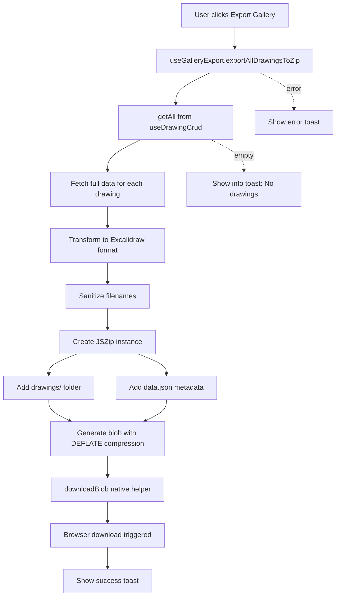

# Design Document: Gallery Export to ZIP

## Context

The Excali Local extension stores multiple Excalidraw drawings in IndexedDB and provides a gallery sidebar for management. Users need a backup/migration capability to export their entire library.

### Performance Analysis

Two approaches were evaluated:

**Official Excalidraw Export API:**
- Requires active Canvas context for each drawing
- Must mount/unmount Canvas for each export
- Performance: 6-30 seconds for 20+ drawings
- High UI impact: Canvas flickering, blocking operations
- Stability depends on DOM/Canvas state

**Manual JSON Assembly (Chosen):**
- Reads directly from IndexedDB storage
- Transforms to Excalidraw format without Canvas
- Performance: < 1 second for typical galleries
- Zero UI impact: Background processing
- Stability depends on stable JSON schema (well-established)

### Key Constraints
- Must work in browser extension environment (Chrome, Firefox, Edge)
- Must maintain compatibility with official Excalidraw format
- Must not block UI during export
- Must not introduce unnecessary dependencies
- All drawings stored in IndexedDB with fields: `elements`, `appState`, `files` (all JSON strings)

## Goals / Non-Goals

### Goals
- Enable one-click export of entire gallery to ZIP
- Achieve < 1 second export time for typical galleries (< 50 drawings)
- Ensure exported files work on excalidraw.com
- Provide clear user feedback during export process
- Handle edge cases gracefully (empty gallery, large datasets)

### Non-Goals
- Selective export (export specific drawings) - reserved for future enhancement
- Import from ZIP functionality - reserved for future enhancement
- PNG/SVG preview generation - would sacrifice performance benefits
- Cloud storage integration
- Export format configuration

## Decisions

### Decision: Manual JSON Assembly over Official API

**Rationale**: Design document shows manual approach is 6-30x faster (< 1s vs 6-30s) and avoids Canvas mounting overhead.

**Implementation**: Directly read from IndexedDB → transform to Excalidraw schema → ZIP generation.

**Tradeoffs**:
- ✅ Pro: Dramatically faster, no UI blocking
- ✅ Pro: Works with storage data directly (no Canvas context needed)
- ⚠️ Con: Must maintain format compatibility manually
- ⚠️ Con: Won't include any Canvas-rendered artifacts (but metadata export doesn't need them)

### Decision: No file-saver Dependency

**Rationale**: Modern browsers (Chrome 52+, Firefox 20+, Safari 10+) fully support native Blob download API via `URL.createObjectURL()` + `<a>` element. Extension targets these browser versions.

**Implementation**: 15-line native `downloadBlob` helper function.

**Tradeoffs**:
- ✅ Pro: Removes 4KB unnecessary dependency
- ✅ Pro: Reduces attack surface
- ✅ Pro: Faster bundle size
- ⚠️ Con: Slightly less battle-tested than file-saver (but API is stable since 2016)

### Decision: JSZip for Compression

**Rationale**: JSZip is the industry-standard in-browser ZIP library with excellent performance and browser compatibility.

**Alternatives Considered**:
- **fflate**: Smaller size but less ergonomic API
- **zip.js**: More features but overkill for this use case

**Tradeoffs**:
- ✅ Pro: Simple API, widely used, well-maintained
- ✅ Pro: Supports streaming and compression options
- ⚠️ Con: ~40KB minified (acceptable for feature value)

### Decision: Batch Processing for Large Datasets

**Rationale**: Exporting 100+ drawings synchronously could block the main thread.

**Implementation**: Process in batches of 50 with `requestAnimationFrame` between batches.

**Tradeoffs**:
- ✅ Pro: Keeps UI responsive
- ✅ Pro: Scales to large galleries
- ⚠️ Con: Slightly more complex code
- ⚠️ Con: Adds minor overhead for small exports (negligible)

### Decision: Dropdown Menu Integration

**Rationale**: Export is a maintenance/utility action similar to "Remove Unused Files", so it logically belongs in the same dropdown menu.

**Placement**: Below "Remove Unused Files" in the save button dropdown.

**Tradeoffs**:
- ✅ Pro: Consistent with existing UI patterns
- ✅ Pro: Doesn't clutter main toolbar
- ✅ Pro: Groups related maintenance actions
- ⚠️ Con: Slightly less discoverable than a dedicated button

## Architecture

### Component Structure

```
gallery-sidebar.tsx
├── useGalleryExport() hook
│   ├── exportAllDrawingsToZip()
│   │   ├── getAll() - fetch all drawings from IndexedDB
│   │   ├── getFullData() - fetch full drawing data
│   │   ├── transformToExcalidrawFormat() - format conversion
│   │   ├── sanitizeFilename() - filename cleaning
│   │   └── JSZip - ZIP generation
│   └── downloadBlob() - native browser download
```

### Data Flow



### Type Definitions

```typescript
// Internal storage format (IndexedDB)
interface Drawing {
  id: string;
  name: string;
  elements: string;    // JSON stringified
  appState: string;    // JSON stringified
  files: string;       // JSON stringified
  thumbnail: string;
  collectionIds: string[];
  createdAt: number;
  updatedAt: number;
}

// Excalidraw export format
interface ExcalidrawFile {
  type: "excalidraw";
  version: 2;
  source: string;
  elements: any[];
  appState: {
    viewBackgroundColor: string;
    gridSize: number | null;
    theme: string;
  };
  files: Record<string, any>;
}

// ZIP metadata
interface ExportMetadata {
  exportedAt: string;
  count: number;
  version: string;
}
```

## Risks / Trade-offs

### Risk: Format Schema Changes
**Impact**: If Excalidraw changes `.excalidraw` format, exports may become incompatible.

**Mitigation**:
- Pin to schema version 2 (current stable)
- Monitor Excalidraw releases for format changes
- Include version in metadata for debugging
- Add E2E test that imports to excalidraw.com

### Risk: Memory Constraints
**Impact**: Exporting 500+ large drawings with embedded images could exhaust memory.

**Mitigation**:
- Batch processing with frame yielding
- Compression level 6 (balanced)
- Document recommended limits (< 200 drawings)
- Future: Stream processing if needed

### Risk: Browser Compatibility
**Impact**: Native download API might fail on very old browsers.

**Mitigation**:
- Extension already requires Chrome 88+, Firefox recent
- Native API supported since Chrome 52, Firefox 20
- Add error handling with fallback message

## Migration Plan

No migration needed - this is a new feature.

### Rollout Strategy
1. Implement feature behind feature flag (optional)
2. Test with various gallery sizes (empty, small, large)
3. Verify imports work on excalidraw.com
4. Release to beta testers
5. Monitor error reports
6. Release to stable

### Rollback
Simple to rollback - remove dropdown menu item and hook. No data migration involved.

## Open Questions

None - all design decisions have been evaluated and documented above.
